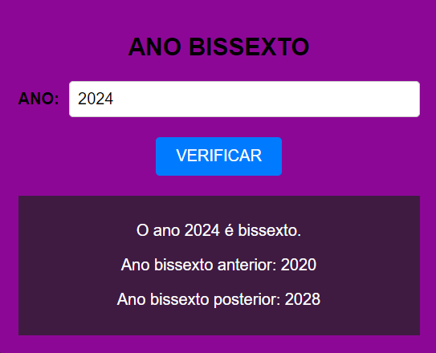

# ANO BISSEXTO
🆎VERIFIQUE SE O ANO É BISSEXTO.

  

## DESCRIÇÃO:
Este projeto trata-se de uma aplicação para verificar se um ano é bissexto, além de fornecer informações sobre o ano bissexto anterior e posterior. Abaixo estão os principais recursos implementados:

1. Verificar Ano Bissexto:
   - Ao clicar no botão "VERIFICAR", o sistema determina se o ano inserido é bissexto ou não.
   - Além disso, ele fornece informações sobre o ano bissexto anterior e posterior.

## EXECUTANDO O PROJETO:
1. Informar o Ano:
   - Digite o ano desejado no campo "ANO".

2. Verificar se é Bissexto:
   - Após fornecer o ano, clique no botão "VERIFICAR" para verificar se ele é bissexto ou não.
   - Caso seja bissexto, será exibida uma mensagem indicando isso, juntamente com os anos bissextos anterior e posterior.

3. Limpar Resultados:
   - Se desejar limpar o resultado da verificação, basta recarregar a página ou atualizá-la. Isso limpará o campo de entrada e os resultados da verificação.

## NÃO SABE?
- Entendemos que para manipular arquivos em `HTML`, `CSS` e outras linguagens relacionadas, é necessário possuir conhecimento nessas áreas. Para auxiliar nesse aprendizado, oferecemos cursos gratuitos disponíveis:
* [CURSO DE HTML E CSS](https://github.com/VILHALVA/CURSO-DE-HTML-E-CSS)
* [CURSO DE JAVASCRIPT](https://github.com/VILHALVA/CURSO-DE-JAVASCRIPT)
* [CONFIRA MAIS CURSOS](https://github.com/VILHALVA?tab=repositories&q=+topic:CURSO)

## CREDITOS:
- [PROJETO CRIADO PELO VILHALVA](https://github.com/VILHALVA)

